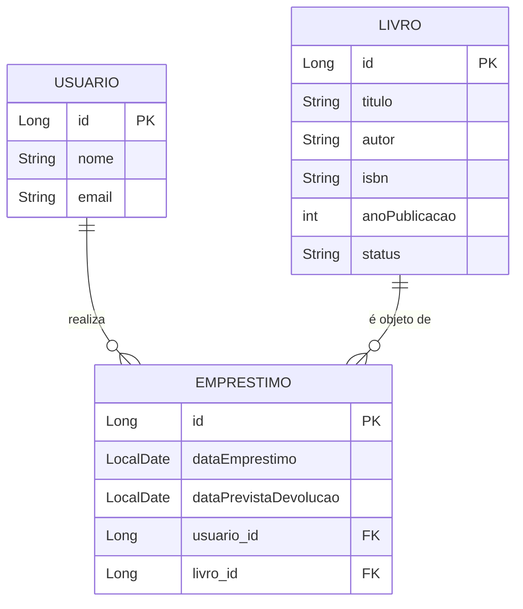

# Biliotech: API de Gerenciamento de Biblioteca

API RESTful para o gerenciamento de uma biblioteca, permitindo o controle de livros, usuários e empréstimos. Este projeto foi desenvolvido como parte de um portfólio prático, com foco na construção de uma arquitetura de software robusta com Java e Spring Boot, além da aplicação de metodologias ágeis no processo de desenvolvimento.

## 🚀 Funcionalidades

* **📚 Gerenciamento de Livros**: CRUD completo para livros, incluindo busca por título e autor.
* **👤 Gerenciamento de Usuários**: CRUD básico para os usuários da biblioteca.
* **↔️ Sistema de Empréstimos e devolução**: Lógica para realizar empréstimos, Devoluções e consulta de históricos atualizando o status do livro de forma transacional.
* **🔍 Busca Avançada**: Endpoints para busca de livros por título e autor.

## 🛠️ Tecnologias Utilizadas

Este projeto foi construído utilizando as seguintes tecnologias:

* **Linguagem**: Java 21
* **Framework**: Spring Boot 3.x
    * **Spring Web**: Para a construção dos endpoints RESTful.
    * **Spring Data JPA**: Para a persistência de dados de forma simplificada.
    * **Hibernate**: Como implementação da JPA.
* **Banco de Dados**: H2 Database (In-Memory)
* **Gerenciador de Dependências**: Maven
* **Utilitários**: Lombok

## 🏁 Como Executar o Projeto

Siga os passos abaixo para executar a aplicação localmente.

```bash
# 1. Clone o repositório
git clone [https://github.com/victorbterra/bibliotech](https://github.com/victorbterra/bibliotech)

# 2. Navegue até a pasta do projeto
cd biliotech
```

3.  Abra o projeto em sua IDE de preferência (IntelliJ, VS Code, Eclipse).
4.  Aguarde a IDE baixar todas as dependências do Maven.
5.  Execute a classe principal `BibliotechApplication.java`.
6.  A aplicação estará disponível em `http://localhost:8080`.

### Acessando o Banco de Dados H2
O console do banco de dados em memória está ativo e pode ser acessado em:
`http://localhost:8080/h2-console`

**Configurações para Login:**
* **Driver Class**: `org.h2.Driver`
* **JDBC URL**: `jdbc:h2:mem:bibliotecadb`
* **User Name**: `sa`
* **Password**: (deixe em branco)

## 📖 Documentação da API

Abaixo estão listados os endpoints disponíveis na aplicação.

### Livros
| Funcionalidade | Método HTTP | Endpoint | Exemplo de Body / Parâmetros |
| :--- | :--- | :--- | :--- |
| **Listar Todos** | `GET` | `/livros` | - |
| **Buscar por ID** | `GET` | `/livros/{id}` | - |
| **Buscar por Título** | `GET` | `/livros/search` | `?titulo=Senhor` |
| **Buscar por Autor** | `GET` | `/livros/search` | `?autor=Tolkien` |
| **Cadastrar Novo** | `POST`| `/livros` | `{ "titulo": "O Hobbit", "autor": "J.R.R. Tolkien", "isbn": "978-8595084742", "anoPublicacao": 1937 }` |

### Usuários
| Funcionalidade | Método HTTP | Endpoint | Exemplo de Body / Parâmetros                                    |
| :--- | :--- | :--- |:----------------------------------------------------------------|
| **Listar Todos** | `GET` | `/usuarios` | -                                                               |
| **Buscar por ID** | `GET` | `/usuarios/{id}` | -                                                               |
| **Cadastrar Novo** | `POST`| `/usuarios` | `{ "nome": "Victor Bruno ", "email": "victorbruno@email.com" }` |

### Empréstimos
| Funcionalidade | Método HTTP | Endpoint | Exemplo de Body / Parâmetros |
| :--- | :--- | :--- | :--- |
| **Realizar Empréstimo**| `POST`| `/emprestimos` | `?usuarioId=1&livroId=1` |

## 📊 Diagrama do Banco de Dados (DER)

O diagrama abaixo representa a estrutura e o relacionamento entre as entidades do banco de dados.



## 👨‍💻 Autor

Projeto desenvolvido por **[Victor Terra]**.

[](https://www.linkedin.com/in/victorbterra/)
[](https://github.com/victorbterra/)